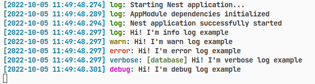

# Logardian

Inspired by NestJS Logger, Logardian was built to output minimalistic, readable logs.

## Roadmap

- [x] OTEL Support
- [x] NodeJS v16.17.1
- [ ] Logging to file

## Installation

> Note: Logardian with version 3.0.0 or higher requires NodeJS 16+ because of async hooks. If you don't want them downgrade to version 2.1.0

```bash
npm i --save logardian
```
    
## Features

- Various layers of logs that can be turned on/off via config
- OpenTelemetry trace ID support
- In production mode debug() does not work
- Datetime in UTC format
- Format of logs: `[time] [level] [layer] [message]`
- In debug mode the path and name of the function that called the log is displayed
- Can be used instead of NestJS Logger
- Can log any objects, arrays, variables
- Modes: normal or json format output
- Colors!

  
## Usage/Examples

```ts
import { Logardian } from 'logardian'

const logger = new Logardian()

logger.configure({
    trace: false,
    labels: ['users', '*.debug']
})

logger.log(`Hi! I'm info log example`)
logger.warn(`Hi! I'm warn log example`)
logger.error(`Hi! I'm error log example`)
logger.verbose(`Hi! I'm verbose log example`)
logger.debug({ some: 'object' })

logger.markTime('marker')

setTimeout(() => {
    logger.measureTime('marker', 'Function take {n} ms to execute')
}, 2000)

logger.log(`I will log`, { label: 'users' })
logger.log(`I will log too`, { label: 'auth.debug' })
logger.log(`I will not log :(`, { label: 'database' })
```

### Default output




### Json output

```ts
logger.configure({
    json: true
})
```

```bash
{"timestamp":"2022-10-10T12:39:40.012Z","message":"Starting Nest application...","level":"log","traceId":"1fbc0d23ba3a"}
{"timestamp":"2022-10-10T12:39:40.017Z","message":"AppModule dependencies initialized","level":"log","traceId":"1fbc0d23ba3a"}
{"timestamp":"2022-10-10T12:39:40.020Z","message":"Nest application successfully started","level":"log","traceId":"c7d5cbef10ea"}
{"timestamp":"2022-10-10T12:39:40.022Z","message":"Hi! I'm info log example","level":"log","traceId":"7a22fdae427ddd12ace3a129e344121b"}
{"timestamp":"2022-10-10T12:39:40.022Z","message":"Hi! I'm warn log example","level":"warn","traceId":"7a22fdae427ddd12ace3a129e344121b"}
{"timestamp":"2022-10-10T12:39:40.022Z","message":"Hi! I'm error log example","level":"error","traceId":"7a22fdae427ddd12ace3a129e344121b"}
{"timestamp":"2022-10-10T12:39:40.022Z","message":"Hi! I'm verbose log example","level":"verbose","traceId":"7a22fdae427ddd12ace3a129e344121b"}
{"timestamp":"2022-10-10T12:39:40.022Z","message":"{\"some\":\"object\"}","level":"debug","traceId":"7a22fdae427ddd12ace3a129e344121b"}
{"timestamp":"2022-10-10T12:39:40.023Z","message":"I will log","level":"log","label":"users","traceId":"7a22fdae427ddd12ace3a129e344121b"}
{"timestamp":"2022-10-10T12:39:40.024Z","message":"I will log too","level":"log","label":"auth.debug","traceId":"7a22fdae427ddd12ace3a129e344121b"}
{"timestamp":"2022-10-10T12:39:42.024Z","message":"Function take 2002.041 ms to execute","level":"timer","traceId":"7a22fdae427ddd12ace3a129e344121b"}
```

### Labels

Labels now support glob patterns! You can dynamically enable and disable the logs you need via `logger.configure()`. For example:

```ts
import { Logardian } from 'logardian'

const logger = new Logardian()

logger.configure({
    labels: ['users.*']
})

logger.log('User sent mail', { label: 'users.email' }) // will log
logger.log('User registered', { label: 'users.auth.registration' }) // will log
logger.log('User authorized', { label: 'users.auth.authorization' }) // will log
logger.log('Database connected', { label: 'database' }) // will NOT log
logger.log('User entity created', { label: 'database.users' }) // will NOT log
```

### OTEL Trace IDs

Use trace ID from your OTEL

```ts
// your create user logic

logger.log('User has been created')
// [2022-10-05 11:34:41.621] [7a22fdae427ddd12ace3a129e344121b]    LOG: User has been created
//                                    ^ unique trace id

// your send email for user logic here

logger.log('Email for user was sent')
// [2022-10-05 11:34:47.317] [7a22fdae427ddd12ace3a129e344121b]    LOG: Mail for user was sent
//                                    ^ same trace id

const traceId = logger.getTraceId()
// 7a22fdae427ddd12ace3a129e344121b
```

### Colors

If you don't like the set of colors logardian provides you can change them in `configure()` function.

```ts
const logger = new Logardian()

logger.configure({
    colors: {
        timestamp: '#ABC'
        traceId: '#CCC
        label: '#FFFFFF
        message: '#FFFFFF
        trace: '#FFFFFF
        stack: '#000000
    }
})
```

## Environment Variables

`NODE_ENV` production start does not show debug() logs

## FAQ

#### How does it implement NestJS Logger without any framework libs?

We made logger based on [LoggerService](https://github.com/nestjs/nest/blob/master/packages/common/services/logger.service.ts) but we don't explicitly import it so that we stay dependless of NestJS libraries. But you can also use the Logardian instead of common NestJS logger.

```ts
// main.ts
import { Logardian } from 'logardian'

const logger = new Logardian()

async function bootstrap(): Promise<void> {
    const app = await NestFactory.create(AppModule, { logger })

    await app.listen(port, hostname, () =>
        logger.log(`Server running at ${hostname}:${port}`),
    )
}
```

#### How can I use logardian in my NestJS service?

Simply create a new logger class

```ts
import { Logardian } from 'logardian'

@Injectable()
export class CatService {
    private readonly _logger = new Logardian()
}
```

#### I do not see my logs with label

Specify labels you want to log or write `*` to log every log with label. 
Working in production and development mode

Logardian is a singleton, so it means that `configure()` works on all Logardian instances

```ts
import { Logardian } from 'logardian'

const logger = new Logardian()

logger.configure({
    labels: '*', // or ['database', 'events'] or false
    trace: false,
    json: true,
    traceId: true
})
```

#### I do not want to see caller and path. How can I turn off them globally?

Specify 'false' on logardian config. If you specify `trace: true` in logger function trace will log in spite of config option

Priority of trace from high to low:

1. Production mode
2. `logger.log('Hello', { trace: true })`
3. `logger.configure({ trace: false })`


## License


[MIT](https://github.com/i-link-pro-team/logardian/blob/main/LICENSE)

  